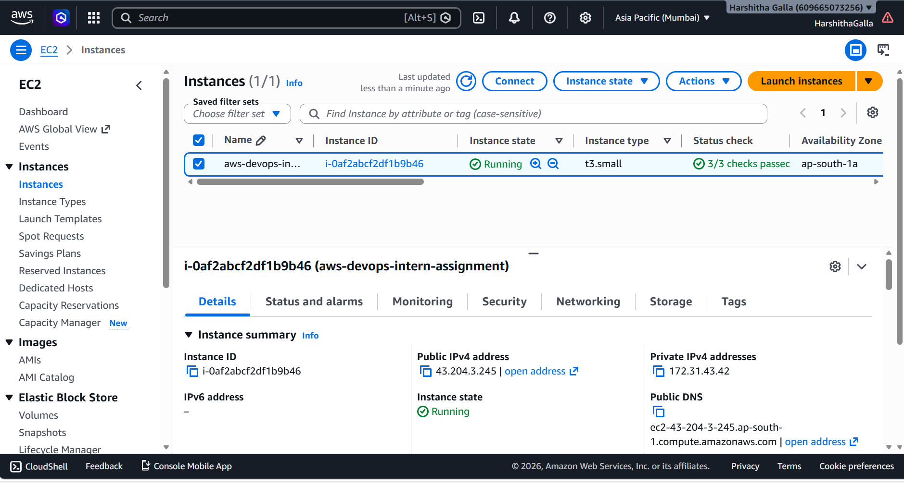
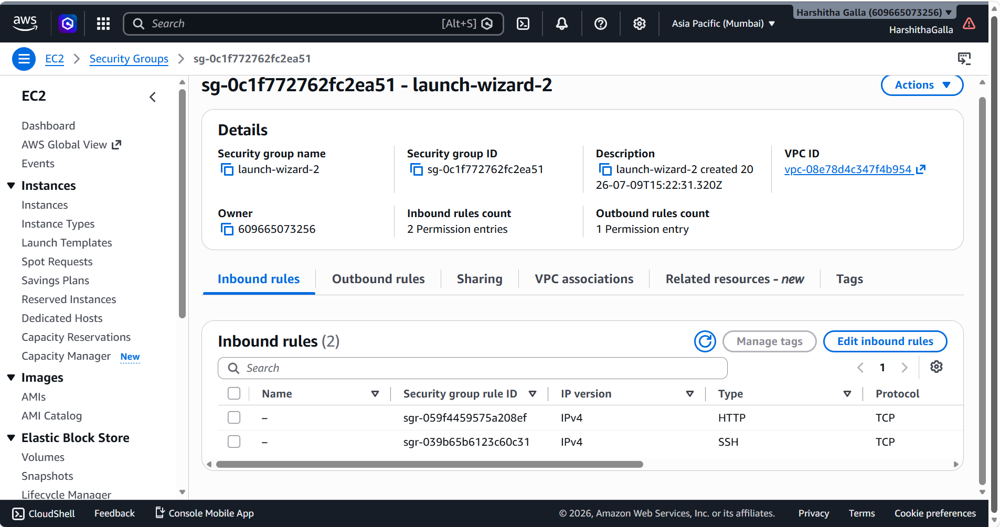
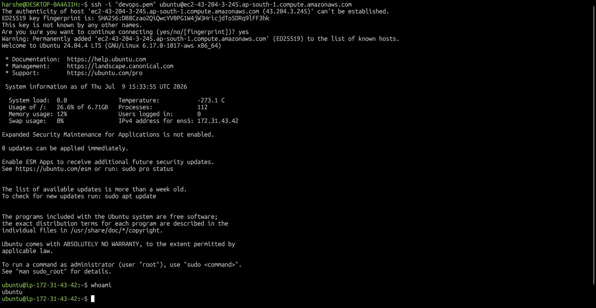
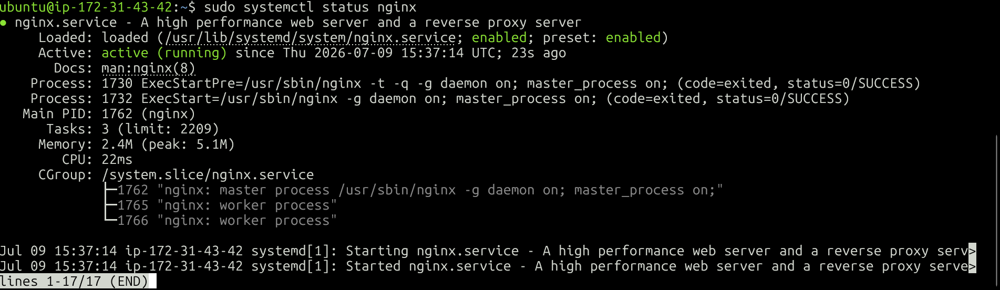
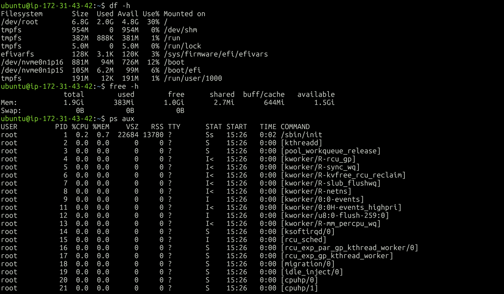
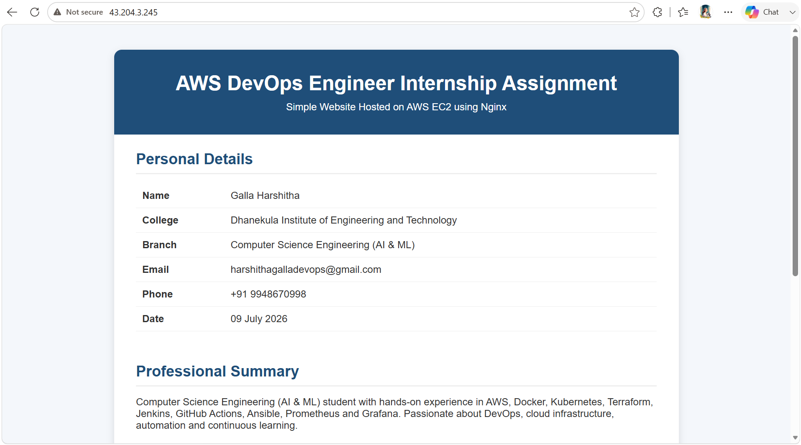
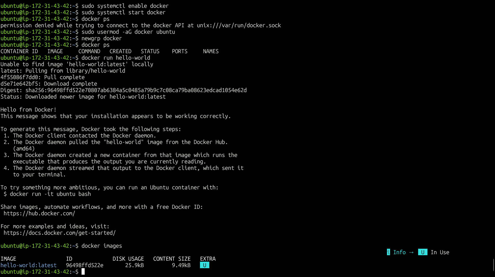
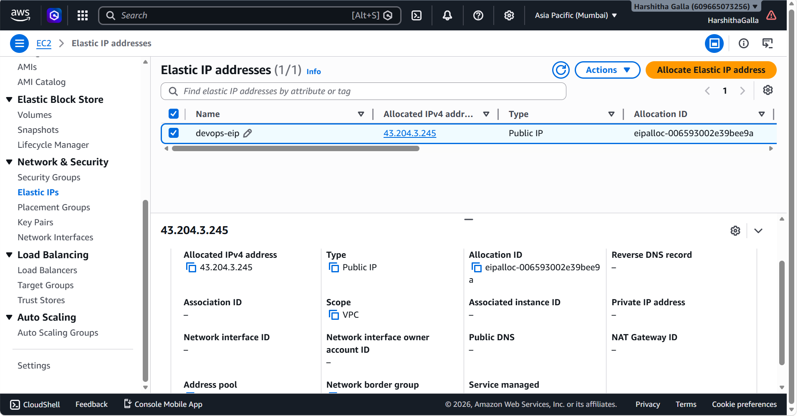

# AWS DevOps Engineer Internship Assignment

This repository contains my submission for the **AWS DevOps Engineer Internship Assignment**. The objective of this assignment was to deploy a simple static website on an AWS EC2 instance using Nginx, document the complete setup process, and manage the project using Git and GitHub.

---

# Technologies Used

- Amazon EC2
- Elastic IP (Bonus)
- Security Groups
- Ubuntu Linux
- Nginx
- Git & GitHub
- Docker (Bonus)

---

# Project Structure

```
aws-devops-engineer-intern-assignment/
│
├── index.html
├── README.md
|
└── screenshots/
    ├── 01-ec2-dashboard.png
    ├── 02-security-group.png
    ├── 03-ssh-login.png
    ├── 04-nginx-status.png
    ├── 05-system-information.png
    ├── 06-website.png
    ├── 07-docker-hello-world.png
    └── 08-elastic-ip.png
```

---

# Task 1 - Launch AWS EC2 Instance

## Step 1: Create an EC2 Instance

- Logged in to the AWS Management Console.
- Navigated to **EC2 Dashboard**.
- Clicked **Launch Instance**.
- Selected **Ubuntu Server 24.04 LTS**.
- Chose **t2.micro** instance type.
- Created a new Key Pair.
- Created a Security Group.
- Allowed SSH (22) and HTTP (80).
- Launched the EC2 instance.

### EC2 Dashboard



---

## Step 2: Configure Security Group

Configured the following inbound rules:

| Type | Port | Source |
|------|------|--------|
| SSH | 22 | My IP |
| HTTP | 80 | Anywhere |

### Security Group



---

## Step 3: Connect to EC2 Using SSH

Connected to the EC2 instance using the downloaded key pair.

```bash
ssh -i devops-assignment-key.pem ubuntu@<YOUR_ELASTIC_IP>
```

### SSH Login



---

# Task 2 - Linux Basics & Nginx Installation

## Step 4: Update Ubuntu Packages

```bash
sudo apt update

sudo apt upgrade -y
```

---

## Step 5: Install Nginx

```bash
sudo apt install nginx -y
```

Check installed version:

```bash
nginx -v
```

---

## Step 6: Verify and Restart Nginx

Check Nginx status:

```bash
sudo systemctl status nginx
```

Restart Nginx:

```bash
sudo systemctl restart nginx
```

Verify again:

```bash
sudo systemctl status nginx
```

### Nginx Status



---

## Step 7: Check System Information

Check disk usage:

```bash
df -h
```

Check memory usage:

```bash
free -h
```

Check running processes:

```bash
ps aux
```

### System Information



---

# Task 3 - Host a Simple Website

## Step 8: Navigate to Nginx Web Directory

```bash
cd /var/www/html
```

Remove the default Nginx page.

```bash
sudo rm index.nginx-debian.html
```

Create a new HTML file.

```bash
sudo nano index.html
```

Paste the HTML content and save the file.

Restart Nginx.

```bash
sudo systemctl restart nginx
```

Open the browser and access:

```
http://<YOUR_ELASTIC_IP>
```

The custom webpage was successfully hosted using Nginx.

### Website Preview



---

# Task 4 - Git & GitHub

## Create Repository

Created a public GitHub repository named:

```
aws-devops-engineer-intern-assignment
```

Initialized the repository and uploaded the project files.

### Git Commands Used

Initialize Git

```bash
git init
```

Add files

```bash
git add .
```

Commit changes

```bash
git commit -m "Initial commit"
```

Add remote repository

```bash
git remote add origin https://github.com/Harshitha-Galla5/aws-devops-engineer-intern-assignment.git
```

Push to GitHub

```bash
git push -u origin main
```

---

# Bonus Task 1 - Docker Installation

Installed Docker on the EC2 instance.

```bash
sudo apt install docker.io -y
```

Enable Docker service.

```bash
sudo systemctl enable docker
```

Start Docker.

```bash
sudo systemctl start docker
```

Run the Hello World container.

```bash
sudo docker run hello-world
```

### Docker Output



---

# Bonus Task 2 - Elastic IP

Allocated an Elastic IP and associated it with the EC2 instance to ensure a static public IP address.

### Elastic IP



---

# Linux Commands Used

| Command | Description |
|----------|-------------|
| `sudo apt update` | Updates package repository |
| `sudo apt upgrade -y` | Upgrades installed packages |
| `sudo apt install nginx -y` | Installs Nginx |
| `nginx -v` | Displays Nginx version |
| `sudo systemctl status nginx` | Checks Nginx service |
| `sudo systemctl restart nginx` | Restarts Nginx |
| `df -h` | Displays disk usage |
| `free -h` | Displays memory usage |
| `ps aux` | Lists running processes |
| `sudo docker run hello-world` | Verifies Docker installation |

---

# AWS Services Used

| AWS Service | Purpose |
|-------------|---------|
| Amazon EC2 | Hosted the Ubuntu server |
| Security Group | Controlled inbound traffic |
| Elastic IP | Provided a static public IP address |

---

# Author

**Galla Harshitha**
harshithagalladevops@gmail.com

LinkedIn: https://www.linkedin.com/in/harshitha-galla-343bab345
GitHub: https://github.com/Harshitha-Galla5